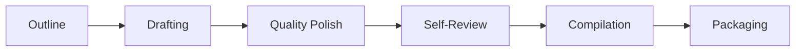

# AutoR — Stage 07: Paper Production Pipeline

AutoR Stage 07 turns research results into submission-ready papers in a single Claude session. Claude handles everything — outlining, drafting, polishing, self-review, compilation, and packaging — while Python only validates that the final artifacts exist.

## Pipeline

Content quality is finalized **before** compilation. The pipeline polishes prose and scores the draft first, then compiles to PDF.



| Phase | What happens |
|-------|-------------|
| **Outline** | Read manifest, set up venue template, generate `math_commands.tex`, design paper skeleton |
| **Drafting** | Write `sections/*.tex` and `references.bib` with DBLP/CrossRef verified entries |
| **Quality Polish** | De-AI rewrite (70+ word list), reverse outline test, logic consistency check, citation pre-check, chktex lint, cleanup |
| **Self-Review** | Score on 8 dimensions (1-10), classify issues as CRITICAL/MAJOR/MINOR, fix up to 2 rounds until overall >= 7.0, output `self_review.json` |
| **Compilation** | `pdflatex` + `bibtex` with self-repair loop (up to 3 retries), post-compilation checks |
| **Packaging** | Copy PDF, build `submission_bundle.zip`, write `build_log.txt`, `citation_verification.json`, `build_manifest.json`, stage summary |

## Design

- **Claude does everything, Python only gates.** Consistent with Stages 1-6 and 8 — `manager.py` orchestrates, `operator.py` calls Claude CLI, `utils.py` validates artifacts, user approves.
- **Polish before compile.** Writing quality iteration happens on `.tex` source, not on rendered PDF. Compilation is a formatting step, not a quality gate.
- **Self-Review Scoring Loop.** Claude scores its own paper on 8 dimensions, fixes issues by severity (CRITICAL first), and must clear a 7.0 threshold with no CRITICAL issues before proceeding.
- **Config-driven templates.** `registry.yaml` supports 9 venues (NeurIPS, ICLR, ICML, CVPR, ACL, AAAI, IEEE Journal/Conference). No hardcoded style files.

## Artifacts

Stage 07 produces 7 validated artifacts:

| Artifact | Location |
|----------|----------|
| `main.tex` | `workspace/writing/` |
| `references.bib` | `workspace/writing/` |
| `sections/*.tex` | `workspace/writing/sections/` |
| `paper.pdf` | `workspace/artifacts/` |
| `build_log.txt` | `workspace/artifacts/` |
| `citation_verification.json` | `workspace/artifacts/` |
| `self_review.json` | `workspace/artifacts/` |

## Project Structure

```
src/
  prompts/07_writing.md    # Full prompt for Claude (375 lines)
  manager.py               # Stage orchestration loop
  operator.py              # Claude CLI invocation
  utils.py                 # Artifact validation (7 checks for Stage 07)
  writing_manifest.py      # Build figures/data manifest for prompt
templates/
  registry.yaml            # 9 venue configurations
tests/
  test_writing_pipeline.py # 20 tests (validation, manifest, registry)
.claude/skills/
  guides/                  # Shared writing knowledge
    writing-principles.md
    venue-checklists.md
    citation-discipline.md
```

## Environment

```bash
conda activate autor_tex   # TeX Live, pdflatex, bibtex, chktex
python -m pytest tests/    # 20 tests
```

## References

Techniques borrowed from these projects:

- [Auto-claude-code-research-in-sleep](https://github.com/JackHopkins/auto-claude-code-research-in-sleep) — Self-review scoring loop (2-round fix cycle, severity classification), writing principles (narrative principle, 5-sentence abstract, Gopen-Swan clarity), venue checklists
- [awesome-ai-research-writing](https://github.com/mlsysops/awesome-ai-research-writing) — De-AI word list (70+ patterns), reviewer template (score + strengths + weaknesses), logic check prompt
